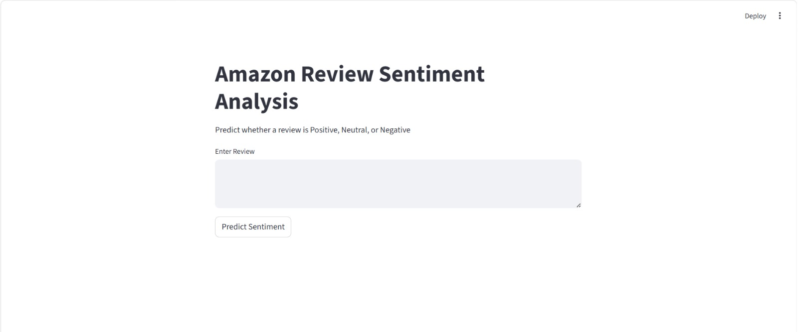

[](https://amazon-food-review-sentiment-analysis-frisacozmbxyjyohhfxadm.streamlit.app/)

# Amazon Review Sentiment Analysis

This project uses Natural Language Processing (NLP) and Machine Learning to classify Amazon food reviews into:
- Positive
- Neutral
- Negative

## Demo


## Features
- NLP preprocessing
- TF-IDF vectorization
- Logistic Regression model
- Streamlit web app
- Real-time sentiment prediction

## Technologies Used
- Python
- Scikit-learn
- NLTK
- Streamlit
- Pandas
- NumPy

## Project Structure
```bash
app/
models/
notebooks/
images/
```

## Run Locally
```bash
pip install -r requirements.txt
python -m streamlit run app/app.py
```

## Future Improvements
- Better negation handling
- Deep learning models
- Transformer-based NLP

## Author
Khathija
Multi-class sentiment analysis on Amazon food reviews using NLP and machine learning.

